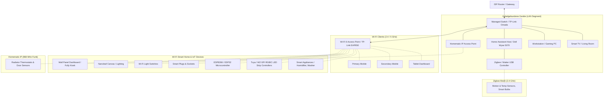
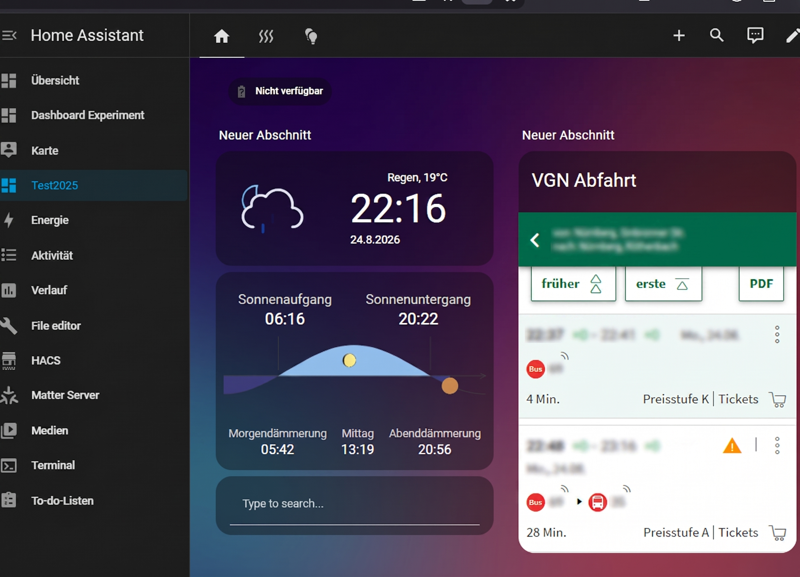

# Home Assistant Configuration

Willkommen in meinem Repository für meine Home-Assistant-Infrastruktur. Hier dokumentiere ich meine Konfigurationen, Automatisierungen und Dashboards.

## 🛠 Hardware & Systeminfrastruktur

* **Host-Hardware:** Dell Wyse 5070 Thin Client
  * **Prozessor:** Intel Celeron J4105 (4 Cores @ 1.50 GHz / Burst 2.50 GHz)
  * **Arbeitsspeicher:** 16 GB DDR4 RAM (2x 8 GB Samsung Dual-Channel)
  * **Speicher:** 256 GB M.2 SATA SSD (Aufgerüstet)
* **Betriebssystem:** Home Assistant OS (HAOS) – Native Bare-Metal Installation
* **Kiosk / Display:** Amazon Fire HD 8 via Fully Kiosk Browser & Kiosk Mode

## 🌐 Netzwerk & Infrastruktur

* **Router / Modem:** Telekom Speedport Smart 4 Plus (Glasfaser)
* **Switch:** TP-Link Omada ES205G (Managed Switch)
* **Access Point:** TP-Link Omada EAP650 (Wi-Fi 6)
* **Network Management:** TP-Link Omada Controller (gehostet als Add-on auf HAOS)
* **Netzwerk-Segmentierung:** Dedizierte VLANs für IoT-Geräte und Smart-Home-Komponenten

### 📊 Netzwerktopologie (Ist-Zustand)

## 🎛️ Integriertes Geräte-Ökosystem & Protokolle

* **Smart Home Standards & Protokolle:** Zigbee 3.0, Homematic IP (868 MHz), Wi-Fi (2.4 / 5 GHz), Matter / Thread
* **Klima & Heizungssteuerung:** Homematic IP Thermostate zur automatisierten Raumtemperaturregelung
* **Sensorik & Umweltdaten:** Zigbee- & Homematic IP-Sensoren für Temperatur, Luftfeuchtigkeit, Bewegung und Tür-/Fensterkontakte
* **Beleuchtung & Custom Hardware:** 
  * Zigbee-Leuchtmittel & Smart Plugs zur Energiemessung
  * **Custom Ambient Lighting:** 24V RGBIC COB-LED-Installation mit digitaler Segmentsteuerung (SPI) via Tuya Zigbee Controller (WZ-SPI)     & 2.4G RF Remote
* **Smart Audio & Voice:** Multiroom-Setup mit 7 Amazon Echo-Geräten (Echo Dot bis Echo Show 8) via Alexa Media Player (TTS-Ankündigungen, Audio-Routing & Smart-Home-Steuerung)

## 📁 Repository-Struktur

* **`automations.yaml`** – Logiken, Trigger und Bedingungen für Smart-Home-Abläufe
* **`configuration.yaml`** – Haupteinstellungen, Systeminfrastruktur, Logging und Custom Sensors
* **`secrets.yaml.example`** – Vorlage für Umgebungsvariablen und Platzhalter
* **`.gitignore`** – Ausschlussfilter für sensible Systemdaten und Token

## 🔒 Datenschutz & Sicherheit

Aus Sicherheitsgründen sind alle IP-Adressen, API-Keys, Passwörter und Geodaten aus diesem Repository entfernt und in eine nicht-öffentliche `secrets.yaml` ausgelagert.

## 🖥 Wallpanel Dashboard

